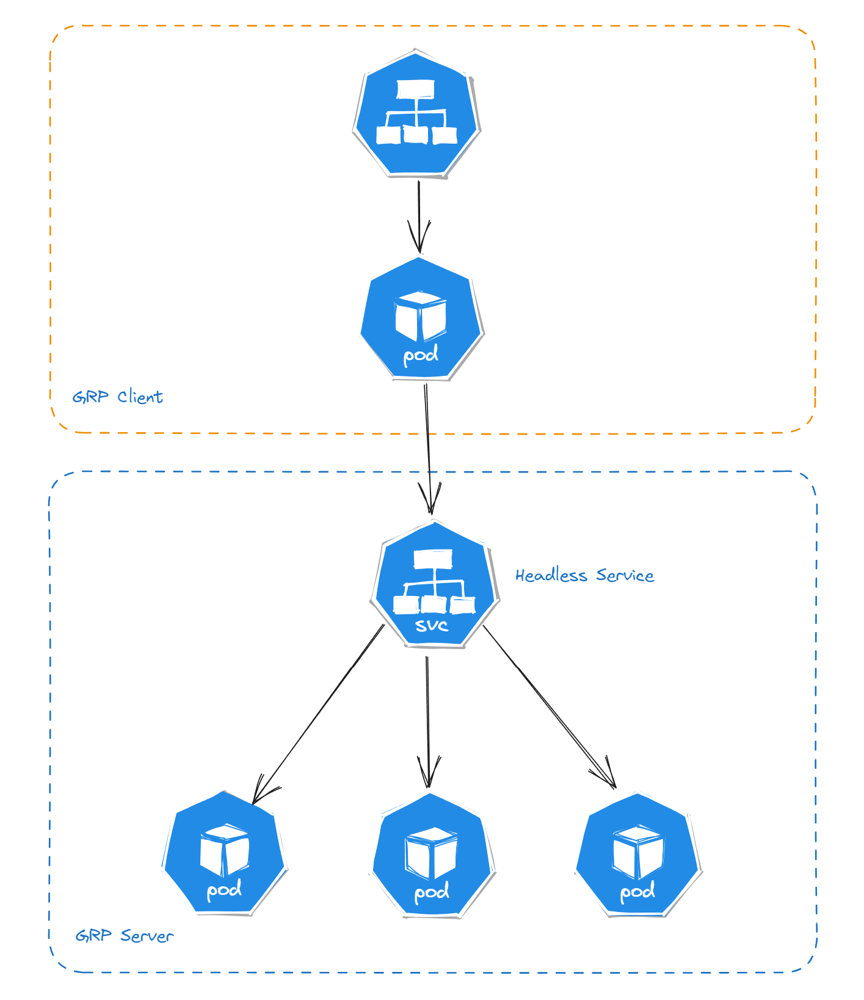

# GRPC Load Balancing with Kubernetes

This is an example of how to use GRPC load balancing with Kubernetes Service, to make this work we need to use [Headless Service](https://kubernetes.io/docs/concepts/services-networking/service/#headless-services) and [Client Side Load Balancing](https://grpc.io/blog/grpc-load-balancing/#client-side-lb-options).

## How to run

### First you need to create a Kubernetes resources

```bash
kubectl apply -f k8s/
```

### Then just call the endpoint

```bash
curl http://localhost:8080/hello
```

### Then watch the logs

```bash
kubectl logs -l app=grpc-server -f --prefix=true
```

## Diagram
